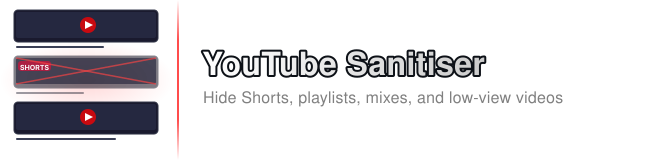
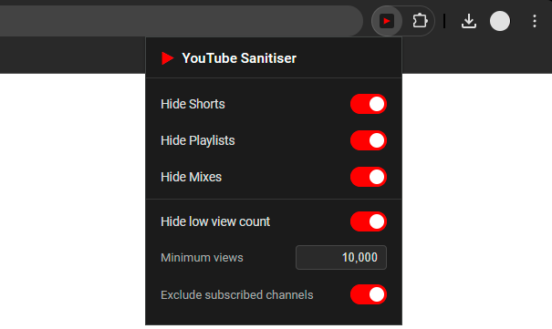

A Chrome extension that strips unwanted content from YouTube so only the videos you actually want to see remain.




---

## Filters

| Filter | What it hides |
| --- | --- |
| **Hide Shorts** | The Shorts shelf on the homepage and Shorts in the watch-page sidebar |
| **Hide Playlists** | Playlist cards in the feed and sidebar (skipped on `/feed/playlists` and channel playlist tabs) |
| **Hide Mixes** | YouTube-generated auto-mix playlists |
| **Hide low view count** | Videos below a configurable minimum view threshold |
| ↳ **Minimum views** | The view count threshold (default 10,000) |
| ↳ **Exclude subscribed channels** | Exempt channels you subscribe to from the low-view filter |

All filters apply instantly when toggled, with no page refresh needed. Settings persist across browser restarts.

---

## Installation

### Chrome Web Store (coming soon)

The extension is pending Chrome Web Store review. Once published, it will be available to install there with no setup required.

### Load unpacked (developer)

1. Clone or download this repository
2. Go to `chrome://extensions`
3. Enable **Developer mode** (toggle in the top-right)
4. Click **Load unpacked** and select the repo folder

To pick up code changes after editing files, click the reload button (↺) on the extension card in `chrome://extensions`, then refresh any open YouTube tabs.

---

## How it works

- A **content script** (`content.js`) runs on every `youtube.com` page and injects `.yt-sanitised { display: none !important }`, so filtered elements are removed from layout with no blank gaps left behind
- A **MutationObserver** catches videos that load dynamically as you scroll; each added node is filtered via its enclosing video renderer, which is re-evaluated from scratch, so late-arriving view-count metadata and renderers YouTube reuses for new videos are handled correctly
- **SPA navigation** is handled by listening to the `yt-navigate-finish` and `yt-page-data-updated` events YouTube fires on every client-side route change
- Settings are stored in `chrome.storage.sync`; the content script listens to `chrome.storage.onChanged`, so every open YouTube tab updates live whenever a toggle is flipped
- **Exclude subscribed channels** reads your subscriptions from the YouTube sidebar (briefly expanding its "Show more" list); this only happens while that option is turned on

---

## Project Structure

```text
youtube-sanitiser/
├── manifest.json       Chrome extension manifest (MV3)
├── defaults.js         Default settings, shared by the content script and popup
├── content.js          Filter logic, MutationObserver, view-count parser
├── popup.html          Settings popup structure
├── popup.css           Dark YouTube-style theme with CSS toggle switches
├── popup.js            Load/save settings in chrome.storage.sync
└── icons/
    ├── generate.html   Regenerates the icon PNGs if the design changes
    ├── icon16.png
    ├── icon48.png
    └── icon128.png
```
